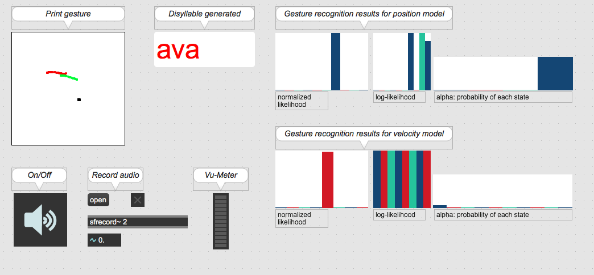

# F-Voks

The instrument F-Voks (Finger-Voks) is a performative vocal synthesizer by gestural control composed of an interface including two graphic tablets, a base of sound samples of sung disyllables, as well as a synthesis engine functioning by concatenation of sound samples with a vocoder. This instrument allows to generate phonemes, then transformed into voice, from gestures on a graphic tablet and to control the pitch and the vocal effort of the synthesized voice. Vowels are represented by a vowel space (triangle or vowel trapezium) on a surface. The gestures generating the consonants are associations of finger movements.

## Comparison of audio samples from ISiS and F-Voks

### Audio sample generated with ISiS n°1
<audio controls>
  <source src="samples/reproRT.wav" type="audio/wav">
Your browser does not support the audio element.
</audio>

### Audio sample after F0 flattening with WORLD
<audio controls>
  <source src="samples/reproRT_flat.wav" type="audio/wav">
Your browser does not support the audio element.
</audio>

### Audio sample generated with ISiS n°2
<audio controls>
  <source src="samples/colasRT.wav" type="audio/wav">
Your browser does not support the audio element.
</audio>

### Audio sample generated with F-Voks n°1
<audio controls>
  <source src="samples/colasRT_V1.wav" type="audio/wav">
Your browser does not support the audio element.
</audio>

### Audio sample generated with F-Voks n°2
<audio controls>
  <source src="samples/colasRT_V2.wav" type="audio/wav">
Your browser does not support the audio element.
</audio>
