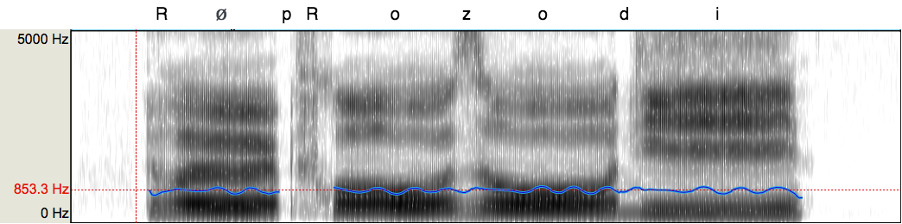
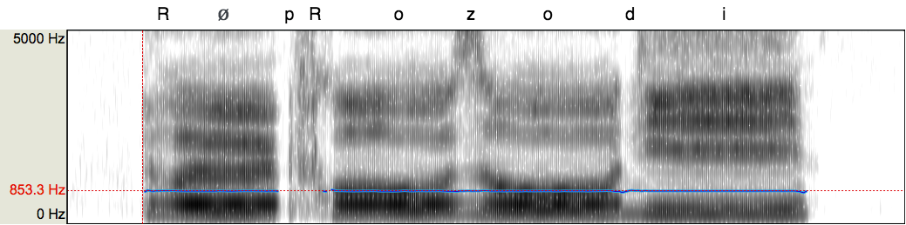
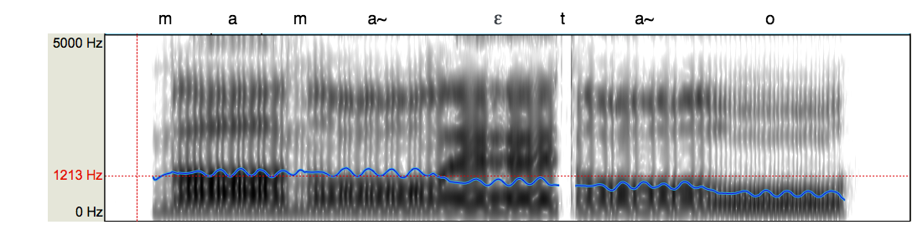
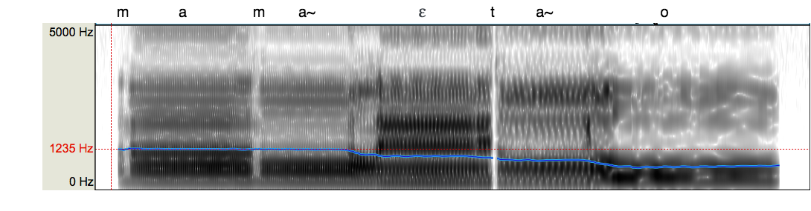
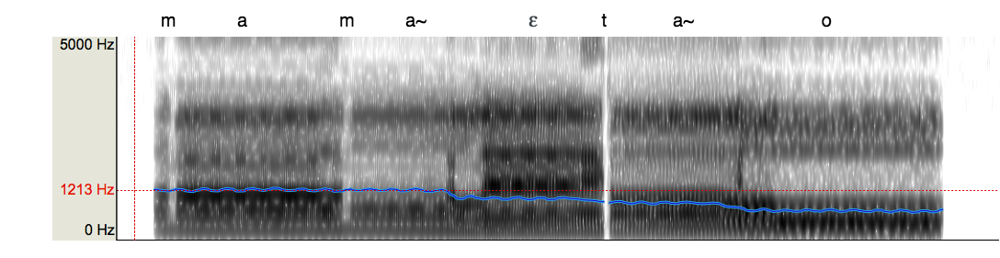
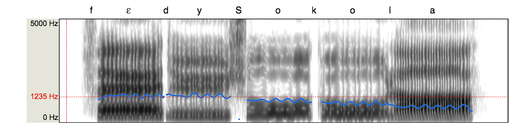
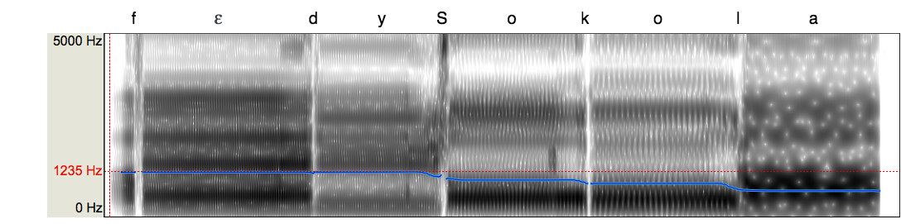
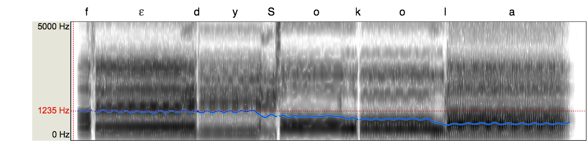

# F-Voks

The instrument F-Voks (Finger-Voks) is a performative vocal synthesizer by gestural control composed of an interface including two graphic tablets, a base of sound samples of sung disyllables, as well as a synthesis engine functioning by concatenation of sound samples with a vocoder. This instrument allows to generate phonemes, then transformed into voice, from gestures on a graphic tablet and to control the pitch and the vocal effort of the synthesized voice. Vowels are represented by a vowel space (triangle or vowel trapezium) on a surface. The gestures generating the consonants are associations of finger movements.

## Comparison of audio samples from ISiS before and after F0 flattening

### Audio sample generated with ISiS
This audio sample is an example generated with ISiS, the french singing synthesizer that we use in order to create a database of audio samples.
<audio controls>
  <source src="samples/reproRT.wav" type="audio/wav">
Your browser does not support the audio element.
</audio>

### Audio sample after F0 flattening with WORLD
This extract is the same example resynthesized with WORLD in order to get a flat fundamental frequency.
<audio controls>
  <source src="samples/reproRT_flat.wav" type="audio/wav">
Your browser does not support the audio element.
</audio>

## Comparison of audio samples generated with ISiS and F-Voks
This section present examples of audio generated with ISiS and then attempted to be recreated with F-Voks.

### First audio sample generated with ISiS
<audio controls>
  <source src="samples/colasRT1_IS.wav" type="audio/wav">
Your browser does not support the audio element.
</audio>

### Audio sample generated with F-Voks n°1
For this first audio sample generated with F-Voks the focus was on the speed and rythm of generation.

<audio controls>
  <source src="samples/colasRT1_V1.wav" type="audio/wav">
Your browser does not support the audio element.
</audio>

### Audio sample generated with F-Voks n°2
For this second audio sample the focus was on the vocal expression, especially to recreate the vibrato of the original recording.

<audio controls>
  <source src="samples/colasRT1_V2.wav" type="audio/wav">
Your browser does not support the audio element.
</audio>

### Second audio sample generated with ISiS

<audio controls>
  <source src="samples/colasRT4_IS.wav" type="audio/wav">
Your browser does not support the audio element.
</audio>

### Audio sample generated with F-Voks n°1
For this first audio sample generated with F-Voks the focus was on the speed and rythm of generation.

<audio controls>
  <source src="samples/colasRT4_V1.wav" type="audio/wav">
Your browser does not support the audio element.
</audio>

### Audio sample generated with F-Voks n°2
For this second audio sample the focus was on the vocal expression, especially to recreate the vibrato of the original recording.

<audio controls>
  <source src="samples/colasRT4_V2.wav" type="audio/wav">
Your browser does not support the audio element.
</audio>

